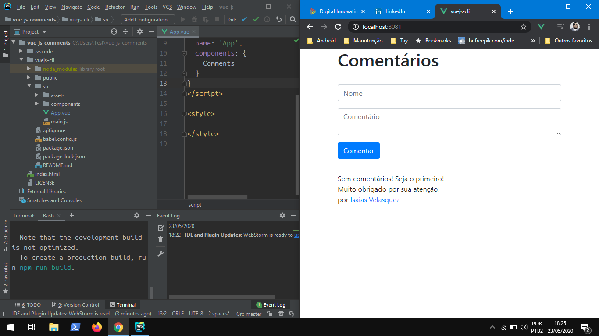

# vue-js-comments

Página simples utilizando Vue.js para comentários. No momento, Sem armazenamento permanente dos mesmos.
É possivel adicionar, remover e postar comentários anônimos.

Para criar este projeto basta clonar o repositório, e na pasta `vuejs-cli` entrar com `npm run serve`

